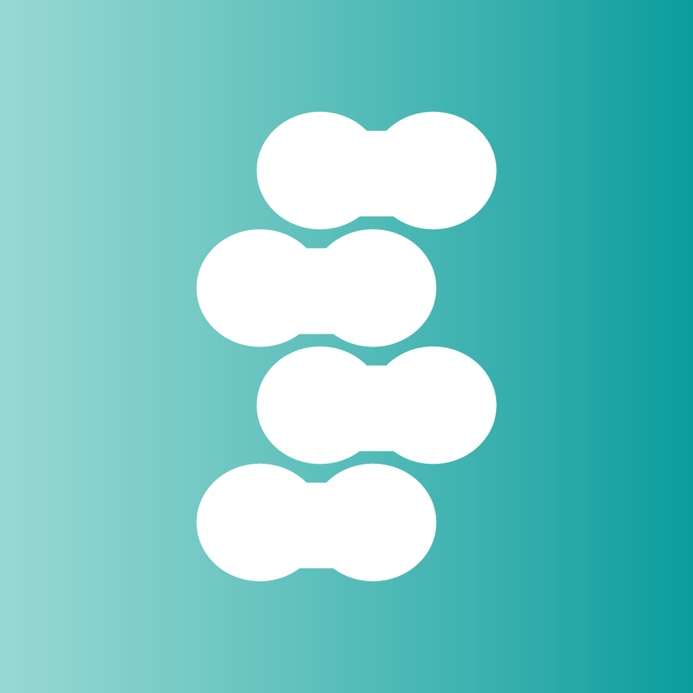
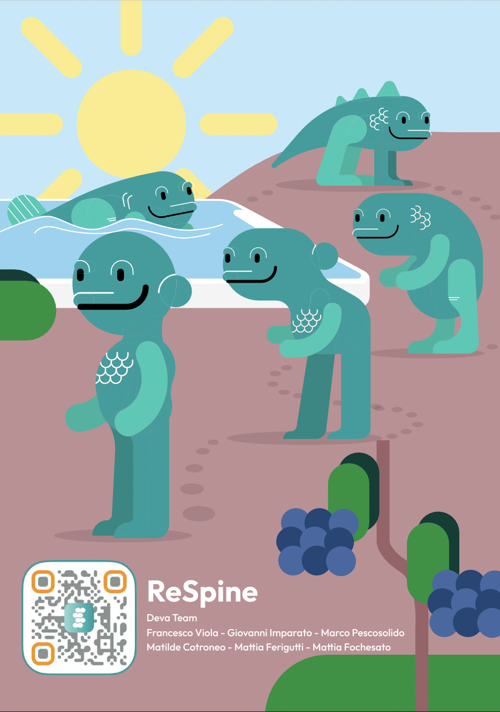

## ReSpine

<meta name="apple-itunes-app" content="app-id=1625109363, app-clip-bundle-id=com.deva.Posturaptor.Clip, app-clip-display=card">

**ReSpine** is an app created by the team called **Deva**.

It is an app that helps sedentary people with postural problems who want to solve their problems and pains.

  
  

## App Statement

**Our** Application **helps** sedentary people with postural problems **who want to** solve their problems and pains **by** learning **and** adopting good habits through a series of mini-games.

  
## Creators

* **Matilde** Cotroneo - *Project Manager*
* **Mattia** Ferigutti - *Product Manager & Backend Developer*
* **Mattia** Fochesato - *Tech Lead*
* **Giovanni** Imparato - *UI Designer & Business*
* **Marco** Pescosolido - *UI/UX Designer*
* **Francesco** Viola - *Frontend Developer*
